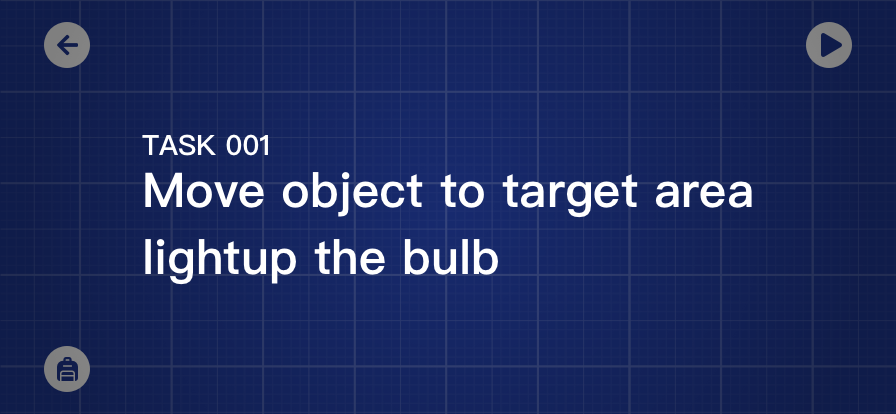
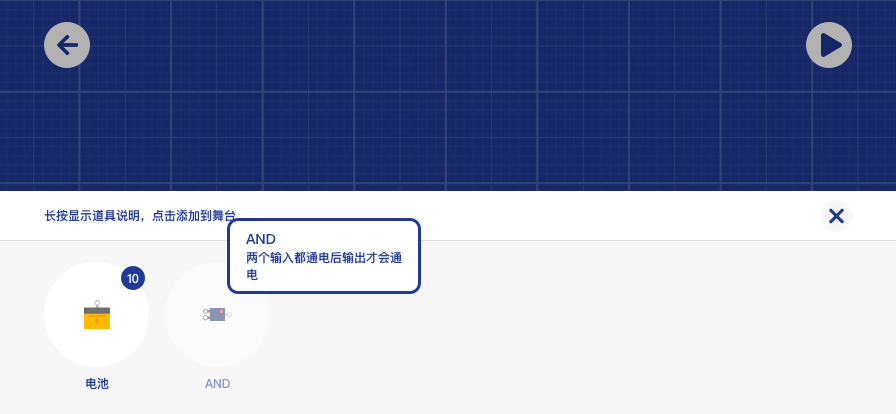
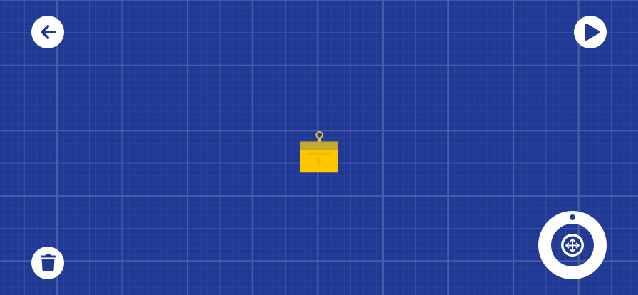

## 玩法概括

在每一关，你需要完成一个任务，如下：你需要点亮灯泡，同时移动物体到目标区域
  
点击左下角背包，你必须使用给定数量与种类的物体来完成条件  
  
当你点击一个物体后会进入选中状态，注意左下角  
这个工具是新增的，整合了微调与旋转功能  
  
目前来说，有两种过关条件，点灯和移动物体到指定区域。  
点灯主要挑战的是电路解密，而移动物体就是非常经典的玩法了。

**当你完成布置后，点击右上角播放，就会进入“模拟阶段”**  
你放置的道具将自动完成移动物体或点灯的任务，这就是“猫猫岛机器”

移动物体的条件可能是复杂的，这是在关卡设计时预先设定好的，检测区可以要求物体的种类和数量。  
举个例子，你必须让区域内存在一个网球 🎾 和一台玩具车 🚗 才能激活过关条件

当你的舞台中有多个检测区时，过关条件会比较复杂。同时通过关卡的方式会被收拢。  
也就是说过关条件越多，过关的方式会越趋于设计师指定的解法。

就是这样，你通关了！觉得好玩吗？  

### 信号接收器

  
交互并不会在“模拟阶段”开始后结束，你仍然可以干预舞台的表现。  
如果你在舞台中放置了信号接收器，你的屏幕上会出现按钮，这时你就可以点按按钮控制接收器的开关了
