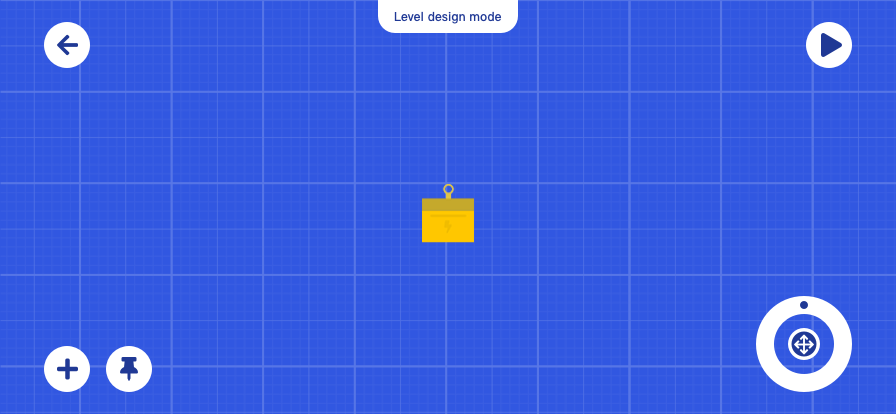

# 面向 SDC 成员的关卡设计指南

感谢阅读这份指南的你愿意为《猫猫岛机器》设计内置关卡，我们会在游戏成员表展示关卡被收录的玩家昵称。
在开始之前你可以先了解一下这个[玩法的概括](/howtoplay.md)

### 与摇摆积木超增量版的差异

《猫猫岛机器》基本上是摇摆积木编辑器的二次利用，虽然呈现出的玩法是完全不同的，但在系统上是类似的。  
不同主要有以下几点：

#### 1.你不能修改物体的具体参数

对于实际的游戏玩家来说，修改与调整参数是一个复杂的操作，所以物体的特性都是固定的。你必须用有限的物品创作关卡。  
用平台来举例，我们把平台拆分成若干个物体，比如特别长的平台，会具现化成“长凳”，比较短的平台会具现化为“扳手”，比较大的球会具现化为“汽车轮胎”，比较小的球会具现化为“网球”

#### 2.物体的种类改变了

因为玩法的改变，平台类物体不存在了  
物体现在有：

- 可动
- 固定
- 电工包
- 检测器

其中检测器是为了配合玩法新增的一种物品，当舞台中所有检测器的条件被满足时就判定关卡通过  
因为你无法调整物体的参数了，所以你不能决定物体是否被固定在一个位置。生活物品被分为了可动与固定两类。

#### 3. 当然了，没有砖块

### 去设计一个关卡

  
与普通玩家界面不同的是，你可以不限量的添加任何物体。  
注意左下角的图钉按钮，这可以把物体变为舞台中的固定物体。  
普通玩家在游玩关卡时，无法调整固定物体的位置和角度。

#### 如何提供玩家可选的道具？

目前这个版本你不能自由指定道具，游戏会自动收集那些舞台中未被“固定”的物体，他们会作为可选道具出现在玩家的关卡中。  
这是自动的。

### 关卡设计的曲线

在[玩法的概括](/howtoplay.md)中，我们提到过，检测区的条件越复杂，关卡的解法会越趋近与设计师预想的解法

### 怎么判定关卡做完了？

点击右上角播放会直接进入模拟阶段，如果通过了...那这个关卡就是做完了，是可玩的。  
游戏会提供关卡数据导出按钮

#### 如何理解？

想象一下，你做了一个关卡，预先放置了一个网球 🎾 和一个纸箱，还提供了一个平台  
那么玩家只需要在固定角度和位置放置平台，让球与平台碰撞，反弹到纸箱里。  
可能有 1 万种角度与位置的配合都能达到过关条件

关卡设计是需要曲线的，本质其实就是一个解法由自由到局限的过程，质量又高、又有难度的关卡必然是通过多个复合的过关条件组成的。  
当然上面那种简单的关卡也是需要的，但只能作为教程关，帮助玩家熟悉操作与机制。

#### 逃课

如何避免逃课，显然就是通过收缩关卡的解法。  
我们不能完全避免逃课，但如果可以逃课的关卡变多了，游戏肯定就不耐玩了，一下子就通关了，而且我们只有 60-90 个关卡  
当然像一些如物理画线类的游戏，通过关卡的数量来弥补关卡质量低的问题，但我觉得我们都能达成共识那样是不好的。
我觉得逃课主要就是因为不确定因素的增加，这个民那应该有自己的看法，我觉得是物理和过关条件过于自由带来的。

#### 思维的转变

摇摆积木到猫猫岛机器在玩法上其实是一种轻度休闲游戏到休闲解密游戏的转变。  
一些随机的、取巧的物理表现可能不会帮助提升关卡质量，不过这是我个人的看法。  
毕竟非常复杂的解密一定会利用电工包，而电工包的逻辑其实是物理无关的。
